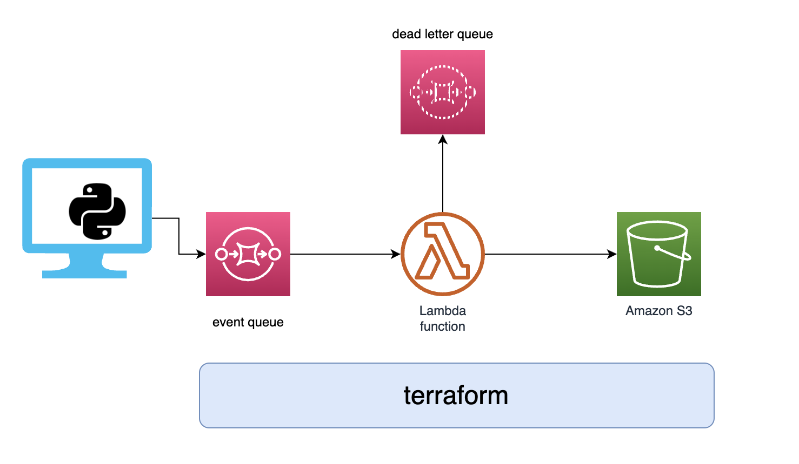

# sqs-lambda-integration-with-terraform




# Terraform

### Commands to know
```bash
terraform plan+
```

```bash
terraform plan -out tplan.tfplan
```

```bash
terraform apply "tplan.tfplan"
```

```bash
terraform workspace list
```

```bash
terraform workspace new {dev,prod}
```

```bash
terraform workspace select {dev,prod}

```bash
terraform apply -auto-approve
```

```bash
terraform destroy -auto-approve
```
